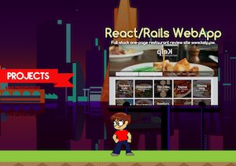

# Personal Portfolio

[![Three.js Library][threejs]][threejs-url]
[![Blender 3D Modeler][blender]][blender-url]
[![Personal Portfolio][personal]][personal-url]

#### [Three.js Arcade Cabinet](https://mikqmas.github.io/)
3D models created with Blender. Page is build on Three.js, rendering via WebGL the HTML canvas and CSS3D renderer used for the iframe within the screen to show my old porfolio. 

#### [Vanilla JS/CSS Side-Scroller Portfolio (2016)](https://mikqmas.github.io/porfolioV1)
Using vanilla JS/CSS to simulate a 2D side-scroller. All assets hand-drawn using Photoshop/Krita.

[threejs]: https://img.shields.io/badge/Threejs%20-%20threejs?label=r169
[threejs-url]: https://github.com/mrdoob/three.js/tree/dev

[blender]: https://img.shields.io/badge/Blender%20-%20blender?label=4.2%20LTS&color=blue
[blender-url]: https://www.blender.org/

[personal]: https://img.shields.io/badge/Personal%20-%20personal?label=V1&color=red
[personal-url]: https://github.com/mikqmas/porfolioV1 

